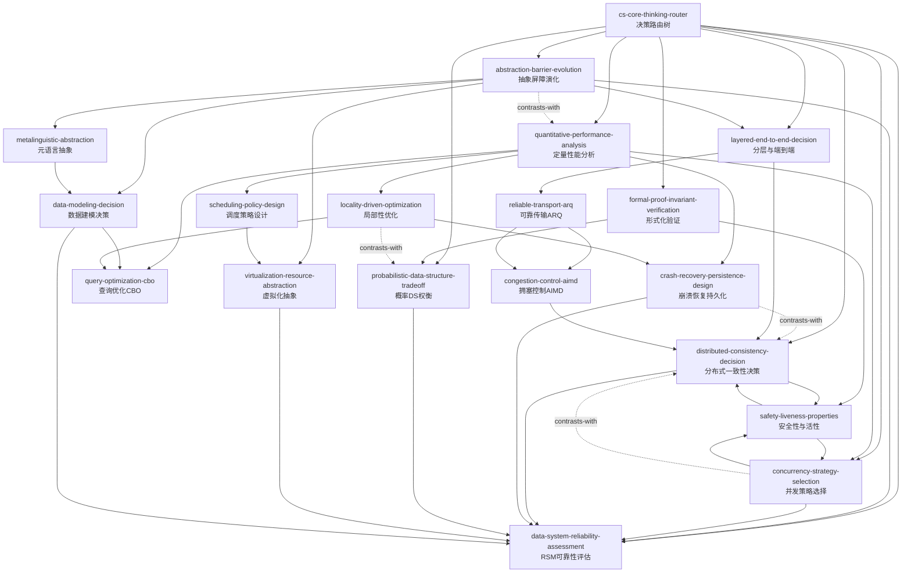

# CS Core Thinking Meta-Framework — Skill Index

> 从 8 本计算机科学经典教材中蒸馏出的跨书核心思维 skills。
> 蒸馏时间: 2026/04/17

## 使用方式

这 18 个 skills 采用**决策路由树**组织。Agent 在接收到相关问题时，**应先调用** `cs-core-thinking-router`，由 router 根据用户语义输出一条明确的 skill 调用链，再按顺序激活具体 skills。这能避免遗漏前置分析（如跳过 `quantitative-performance-analysis` 直接调 `concurrency-strategy-selection`）或错误匹配。

---

## Skill 总览

| Skill | 核心问题 | 来源书籍 |
|---|---|---|
| **quantitative-performance-analysis** | 如何用量化方法避免感性优化和过早优化？ | CAQA, DDIA |
| **locality-driven-optimization** | 如何利用时间/空间局部性指导缓存、存储和算法设计？ | CAQA, OSTEP, AADS |
| **probabilistic-data-structure-tradeoff** | 如何在资源受限时权衡空间-时间-正确性，使用概率数据结构？ | MCS, AADS |
| **scheduling-policy-design** | 如何根据 workload 特征推导调度策略（CFS/MLFQ/lottery）？ | OSTEP |
| **query-optimization-cbo** | 数据库查询优化器如何基于代价选择执行计划（CBO/System R）？ | RedBook |
| **layered-end-to-end-decision** | 功能应放在系统哪一层实现（分层 vs 端到端原则）？ | CN, SICP, OSTEP |
| **reliable-transport-arq** | 不可靠信道上如何设计可靠传输（ACK/重传/超时/序列号）？ | CN, OSTEP |
| **congestion-control-aimd** | 共享网络中如何公平高效地分配带宽（AIMD/cwnd）？ | CN, OSTEP |
| **concurrency-strategy-selection** | 悲观锁 vs 乐观锁/MVCC/SSI 如何根据 workload 选择？ | OSTEP, RedBook, DDIA |
| **distributed-consistency-decision** | 分布式系统中的一致性级别如何选择（CAP/PACELC）？ | DDIA, RedBook |
| **formal-proof-invariant-verification** | 如何用归纳法和不变量原理验证系统正确性？ | MCS, SICP, OSTEP |
| **safety-liveness-properties** | 如何用 Safety/Liveness 分类并发与分布式协议的正确性属性？ | MCS, OSTEP, DDIA |
| **data-system-reliability-assessment** | 如何系统化评估后端系统的 R/S/M 三维度？ | DDIA |
| **crash-recovery-persistence-design** | 文件系统/数据库如何选择崩溃恢复策略（WAL/LFS/COW）？ | OSTEP, RedBook, DDIA |
| **data-modeling-decision** | 关系型/文档型/图数据库如何选型与建模？ | DDIA, RedBook |
| **abstraction-barrier-evolution** | 如何设计可长期演化的抽象边界和接口？ | SICP, RedBook, DDIA |
| **virtualization-resource-abstraction** | 如何通过虚拟化抽象管理 CPU/内存/磁盘资源？ | OSTEP, SICP |
| **metalinguistic-abstraction** | 如何通过元语言抽象（解释器/DSL/同像性）控制复杂度？ | SICP |

---

## 引用关系图

---

## 按问题域导航

### 性能与优化
- [quantitative-performance-analysis](quantitative-performance-analysis/SKILL.md) — 加速上限评估、CPU 时间拆解、负载-性能建模
- [locality-driven-optimization](locality-driven-optimization/SKILL.md) — 缓存设计、数据布局、存储引擎调优
- [probabilistic-data-structure-tradeoff](probabilistic-data-structure-tradeoff/SKILL.md) — Bloom filter、Treap、R-tree 等概率结构选型
- [scheduling-policy-design](scheduling-policy-design/SKILL.md) — 工作负载特征→性能指标→调度策略的量化推导
- [query-optimization-cbo](query-optimization-cbo/SKILL.md) — 基于代价的查询优化、System R 框架、Volcano 执行模型

### 网络与传输
- [layered-end-to-end-decision](layered-end-to-end-decision/SKILL.md) — 协议栈分层、端到端原则、功能放置决策
- [reliable-transport-arq](reliable-transport-arq/SKILL.md) — 序列号、ACK、重传、超时、滑动窗口
- [congestion-control-aimd](congestion-control-aimd/SKILL.md) — 加性乘性减小、cwnd/ssthresh、公平收敛

### 并发、一致性与正确性
- [concurrency-strategy-selection](concurrency-strategy-selection/SKILL.md) — 锁、MVCC、SSI、OCC 的选型
- [distributed-consistency-decision](distributed-consistency-decision/SKILL.md) — CAP/PACELC、Linearizability、共识协议
- [formal-proof-invariant-verification](formal-proof-invariant-verification/SKILL.md) — 数学归纳法、不变量原理、状态机正确性证明
- [safety-liveness-properties](safety-liveness-properties/SKILL.md) — Safety 与 Liveness 分类、协议正确性属性分析

### 数据与存储系统
- [data-system-reliability-assessment](data-system-reliability-assessment/SKILL.md) — RSM 评估、容量规划、故障分析
- [crash-recovery-persistence-design](crash-recovery-persistence-design/SKILL.md) — WAL、ARIES、LFS、COW、RAID
- [data-modeling-decision](data-modeling-decision/SKILL.md) — 关系/文档/图模型选型、polyglot persistence

### 抽象、虚拟化与语言
- [abstraction-barrier-evolution](abstraction-barrier-evolution/SKILL.md) — 接口-实现分离、数据独立性、版本化策略
- [virtualization-resource-abstraction](virtualization-resource-abstraction/SKILL.md) — CPU/内存/磁盘虚拟化、受限直接执行、页表机制
- [metalinguistic-abstraction](metalinguistic-abstraction/SKILL.md) — 解释器、DSL、同像性、元循环求值

---

## 审计统计

- **Books**: 8
- **Candidate units extracted**: 144 (23 frameworks + 24 principles + 22 cases + 30 counter-examples + 45 glossary terms)
- **Skills distilled**: 18
- **Meta-router**: 1 (`cs-core-thinking-router`)
- **Triple-verified**: V1 ✓ / V2 ✓ / V3 ✓
- **Darwin test prompts**: 18 × (3 should_trigger + 2 should_not_trigger + 1 edge_case)

---

## 来源书籍缩写

- **CAQA**: *Computer Architecture: A Quantitative Approach* — Hennessy & Patterson
- **CN**: *Computer Networking: A Top-Down Approach* — Kurose & Ross
- **DDIA**: *Designing Data-Intensive Applications* — Martin Kleppmann
- **OSTEP**: *Operating Systems: Three Easy Pieces* — Arpaci-Dusseau
- **RedBook**: *Readings in Database Systems* — Stonebraker et al.
- **SICP**: *Structure and Interpretation of Computer Programs* — Abelson & Sussman
- **MCS**: *Mathematics for Computer Science* — Lehman et al.
- **AADS**: *Advanced Algorithms and Data Structures* — La Rocca
