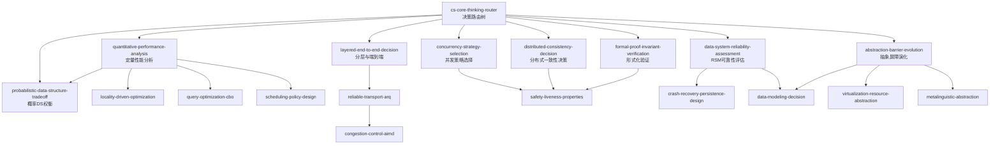

# CS Core Thinking Meta-Framework

> 从 8 本计算机科学经典教材中蒸馏出的 **18 个可执行 Agent Skills + 1 个决策路由树**。

---

## Quick Start

- **[安装到 Claude Code →](INSTALL.md)**（符号链接方式，推荐）
- **[查看完整 Skill 索引 →](INDEX.md)**（含 Mermaid 依赖关系图）
- **[阅读 Router 使用说明 →](cs-core-thinking-router/SKILL.md)**

---

## 这是什么？

这不是读书笔记，而是一组**可被 Claude Code 直接调用的方法论 Skills**。

当我们在讨论系统设计、性能优化、并发控制或数据存储时，Agent 常常面临一个问题：**18 个 skills 该调哪个？** 跳过前置分析（如直接谈锁策略而不先做量化分析）或错误匹配领域（如把网络拥塞当成缓存局部性问题）都会导致低质量的回答。

**`cs-core-thinking-router`** 就是这个问题的解：它是 18 个 skills 的**唯一统一入口**。Agent 收到相关问题时必须先调 router，由 router 输出一条明确的 skill 调用链，再按顺序激活具体 skills。

这能避免两类常见错误：
- **遗漏前置分析**：如跳过 `quantitative-performance-analysis` 直接调 `concurrency-strategy-selection`
- **错误匹配**：如把网络拥塞问题误当作缓存局部性问题处理

---

## 18 个核心 Skills（按问题域分组）

### 性能与优化

| Skill | 核心问题 | 来源书籍 |
|---|---|---|
| **quantitative-performance-analysis** | 如何用量化方法避免感性优化和过早优化？ | CAQA, DDIA |
| **locality-driven-optimization** | 如何利用时间/空间局部性指导缓存、存储和算法设计？ | CAQA, OSTEP, AADS |
| **probabilistic-data-structure-tradeoff** | 如何在资源受限时权衡空间-时间-正确性，使用概率数据结构？ | MCS, AADS |
| **scheduling-policy-design** | 如何根据 workload 特征推导调度策略（CFS/MLFQ/lottery）？ | OSTEP |
| **query-optimization-cbo** | 数据库查询优化器如何基于代价选择执行计划（CBO/System R）？ | RedBook |

### 网络与传输

| Skill | 核心问题 | 来源书籍 |
|---|---|---|
| **layered-end-to-end-decision** | 功能应放在系统哪一层实现（分层 vs 端到端原则）？ | CN, SICP, OSTEP |
| **reliable-transport-arq** | 不可靠信道上如何设计可靠传输（ACK/重传/超时/序列号）？ | CN, OSTEP |
| **congestion-control-aimd** | 共享网络中如何公平高效地分配带宽（AIMD/cwnd）？ | CN, OSTEP |

### 并发、一致性与正确性

| Skill | 核心问题 | 来源书籍 |
|---|---|---|
| **concurrency-strategy-selection** | 悲观锁 vs 乐观锁/MVCC/SSI 如何根据 workload 选择？ | OSTEP, RedBook, DDIA |
| **distributed-consistency-decision** | 分布式系统中的一致性级别如何选择（CAP/PACELC）？ | DDIA, RedBook |
| **formal-proof-invariant-verification** | 如何用归纳法和不变量原理验证系统正确性？ | MCS, SICP, OSTEP |
| **safety-liveness-properties** | 如何用 Safety/Liveness 分类并发与分布式协议的正确性属性？ | MCS, OSTEP, DDIA |

### 数据与存储系统

| Skill | 核心问题 | 来源书籍 |
|---|---|---|
| **data-system-reliability-assessment** | 如何系统化评估后端系统的 R/S/M 三维度？ | DDIA |
| **crash-recovery-persistence-design** | 文件系统/数据库如何选择崩溃恢复策略（WAL/LFS/COW）？ | OSTEP, RedBook, DDIA |
| **data-modeling-decision** | 关系型/文档型/图数据库如何选型与建模？ | DDIA, RedBook |

### 抽象、虚拟化与语言

| Skill | 核心问题 | 来源书籍 |
|---|---|---|
| **abstraction-barrier-evolution** | 如何设计可长期演化的抽象边界和接口？ | SICP, RedBook, DDIA |
| **virtualization-resource-abstraction** | 如何通过虚拟化抽象管理 CPU/内存/磁盘资源？ | OSTEP, SICP |
| **metalinguistic-abstraction** | 如何通过元语言抽象（解释器/DSL/同像性）控制复杂度？ | SICP |

---

## 路由决策树



---

## 使用示例

| 用户问题 | Router 判定 | 调用链 |
|---|---|---|
| "这个架构能不能撑住流量翻倍？" | 性能 + 可靠性 | `quantitative-performance-analysis` → `data-system-reliability-assessment` |
| "我们该用悲观锁还是乐观锁？" | 并发控制 | `concurrency-strategy-selection` |
| "TCP 丢包怎么恢复？" | 网络/协议 | `layered-end-to-end-decision` → `reliable-transport-arq` |
| "Bloom filter 假阳性率怎么算？" | 概率数据结构 | `probabilistic-data-structure-tradeoff` |
| "如何证明这个并发算法正确？" | 形式化验证 | `formal-proof-invariant-verification` → `safety-liveness-properties` |

---

## 项目结构

```
cs-core-thinking-meta/
├── BOOK_OVERVIEW.md               # 阶段 0: 跨书元框架理解
├── INDEX.md                       # 完整索引 + Mermaid 依赖图
├── README.md                      # 本文件
├── INSTALL.md                     # 安装指南
├── LICENSE                        # MIT
├── cs-core-thinking-router/       # 统一入口
│   ├── SKILL.md
│   └── test-prompts.json          # Darwin 兼容测试集
├── candidates/                    # 阶段 1 提取的候选池
│   ├── frameworks.md              # 23 个框架
│   ├── principles.md              # 24 条原则
│   ├── cases.md                   # 22 个案例
│   ├── counter-examples.md        # 30 个失败模式
│   └── glossary.md                # 45 个术语
├── references/                    # 跨 skill 共享资源
│   ├── common-counter-examples.md # 失败模式速查 (ce01–ce28)
│   ├── common-formulas.md         # 跨 skill 通用公式
│   └── glossary-quickref.md       # 核心术语与常见误解
├── rejected/                      # 阶段 1.5 淘汰的候选
└── <skill-name>/                  # 18 个原子 skill
    ├── SKILL.md
    └── test-prompts.json
```

---

## 来源书籍

- **CAQA**: *Computer Architecture: A Quantitative Approach* — Hennessy & Patterson
- **CN**: *Computer Networking: A Top-Down Approach* — Kurose & Ross
- **DDIA**: *Designing Data-Intensive Applications* — Martin Kleppmann
- **OSTEP**: *Operating Systems: Three Easy Pieces* — Arpaci-Dusseau
- **RedBook**: *Readings in Database Systems* — Stonebraker et al.
- **SICP**: *Structure and Interpretation of Computer Programs* — Abelson & Sussman
- **MCS**: *Mathematics for Computer Science* — Lehman et al.
- **AADS**: *Advanced Algorithms and Data Structures* — La Rocca

---

## 扩展框架：如何添加第 19 个 Skill？

本框架设计为可扩展。如果你读完第 9 本书并想加入新的 skill，建议按以下流程：

1. **提取**：用 [`cangjie-skill`](https://github.com/kangarooking/cangjie-skill) 方法论提取候选单元（frameworks / principles / cases / counter-examples / glossary）
2. **验证**：通过三重验证（V1 跨域 / V2 预测力 / V3 独特性）
3. **构造**：编写 `SKILL.md`（R/I/A1/A2/E/B 六段）+ `test-prompts.json`（Darwin 兼容格式）
4. **注册**：在 `cs-core-thinking-router/SKILL.md` 的决策树中新增路由分支
5. **更新**：同步修改 `INDEX.md` 和 `README.md`

更多细节请参考 `BOOK_OVERVIEW.md` 和 `INDEX.md`。

---

## 审计统计

- **Books**: 8
- **Candidate units extracted**: 144 (23 frameworks + 24 principles + 22 cases + 30 counter-examples + 45 glossary terms)
- **Skills distilled**: 18
- **Meta-router**: 1 (`cs-core-thinking-router`)
- **Triple-verified**: V1 ✓ / V2 ✓ / V3 ✓
- **Darwin test prompts**: 18 × (3 should_trigger + 2 should_not_trigger + 1 edge_case)

---

## License

MIT
